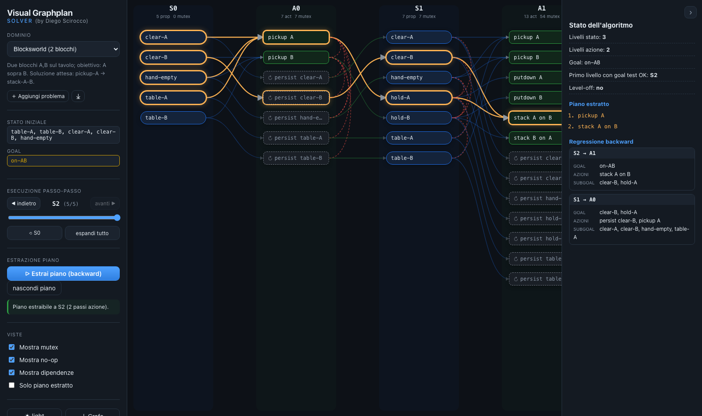
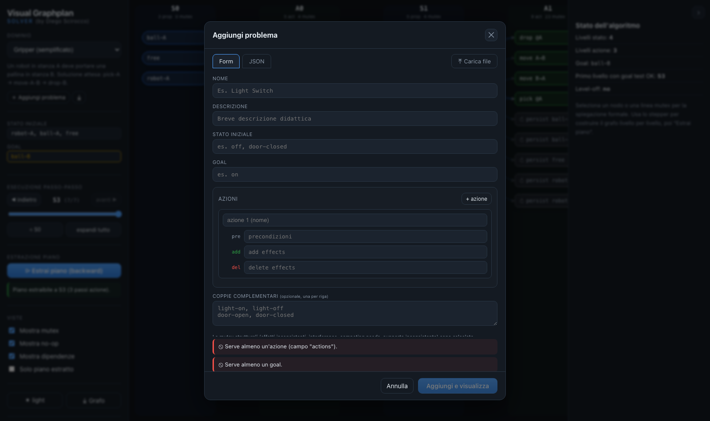

# Visual Graphplan Solver

An interactive, didactic web app that is, to every effect, a real **Graphplan**
solver (Blum & Furst, 1997) — not just a static diagram generator. Given a
propositional STRIPS domain, the engine actually expands the planning graph,
computes every mutex, runs the goal test, and performs backward plan extraction
with backtracking to either produce a valid, executable plan or correctly prove
the problem unsolvable. The visual layer on top builds, renders, and explains
that solving process step by step: the alternating layers of the planning
graph, the persistence (no-op) actions, the mutex relations between actions and
between literals, the goal test at each level, the level-off condition, and the
backward extraction of the plan it found.

## Screenshots

Example of a planning graph as rendered by the app:



Example of the form used to enter a custom problem:



## Goal of the Project

The app is a single-page solver and teaching tool, not an industrial-scale
planner — the scope is deliberately small propositional domains rather than
large grounded PDDL problems. Within that scope it solves for real: it does
not pre-script or fake the plans it shows, it derives them by actually running
Graphplan's expansion and backward-extraction algorithm on whatever domain is
loaded, built-in or user-supplied. The focus is making the solving process
observable: graph construction, insertion of persistence actions, computation
of mutexes, goal testing, and backward plan extraction, all visible at every
step. The target user is a student or a teacher who wants to see both the
answer and exactly how Graphplan got there.

The engine is intentionally separated from the user interface, so the solving
logic can be read, tested, and reused independently of the visualization.

## Quick Start

Requirements: Node.js version 18 or newer.

```bash
npm install
npm run dev        # development server at http://localhost:5173
```

Other commands:

```bash
npm test           # unit and end-to-end tests for the engine (Vitest)
npm run build      # production build into dist/
npm run preview    # serve the production build
```

## Features

- Expansion of the planning graph as an alternating sequence of state levels
  and action levels (S0, A0, S1, A1, and so on).
- Automatic generation of no-op (persistence) actions for every literal present
  at a level; no-ops are treated as first-class actions but are clearly marked.
- Action mutexes: inconsistent effects, interference, and competing needs.
- Proposition mutexes: negation (user-declared complementary pairs) and
  inconsistent support.
- Goal test at every level: all goals present and no goal pair mutually
  exclusive.
- Backward plan extraction with backtracking, plus an outer expand-then-extract
  loop so problems that need extra levels (goal interactions) are solved
  correctly.
- Level-off detection: the graph is marked as stabilized when a new level adds
  no propositions and does not change the set of mutexes. If the goals are still
  not extractable, the problem is reported as unsolvable.
- Contextual explanation panel that justifies, in readable form, why a node or a
  mutex exists.

## Interface

The layout has three panels.

- Left panel: domain selector, initial state and goals, step-by-step execution
  controls (stepper and slider to build the graph one level at a time), plan
  extraction, view toggles (mutexes, no-ops, dependencies, plan-only),
  light/dark theme, and JSON export of the current graph.
- Center panel: the planning-graph canvas. The layout is deterministic and
  level-based, never force-directed, because Graphplan has an intrinsically
  layered temporal and causal structure. Propositions are rendered as pills,
  actions as cards, no-ops as dashed cards, goals are highlighted, mutexes are
  dashed red arcs, and the extracted plan is shown with a colored glow.
- Right panel: a collapsible explanation panel. Click a node or a mutex to see
  its formal justification; when nothing is selected it shows the algorithm
  state, the extracted plan, and the backward regression step by step.

Interactions include hovering or clicking an action (preconditions and add/del
effects), clicking a proposition (which actions support it), and clicking a
mutex (its formal reason).

## Demo Domains

| Domain                     | Teaching purpose                                                                        |
| -------------------------- | --------------------------------------------------------------------------------------- |
| Gripper (simplified)       | Solvable in a few levels: pick at A, move A to B, drop at B.                            |
| Blocksworld (2 blocks)     | Solvable: pickup A, then stack A on B.                                                  |
| Rocket (parallel actions)  | Shows parallel actions in the same level: load both packages, fly, unload both.         |
| Spare Tire                 | Classic Russell and Norvig example: mounting the spare tire.                            |
| Sussman Anomaly (3 blocks) | Goal interaction: the subgoals cannot be achieved independently. Optimal six-step plan. |
| Monkey and Bananas         | Textbook AI planning problem: go, push, climb, grab.                                    |
| Have Cake and Eat It       | Goals present but mutex at S1, extractable at S2.                                       |
| Vault                      | Unsolvable: the key is missing, the graph levels off immediately.                       |

## Custom Problems

The "Aggiungi problema" button, under the domain selector, opens an editor with
two modes.

- Form mode: fields for name, initial state, goals, and a list of actions, each
  with preconditions, add effects, and delete effects (atoms separated by
  spaces or commas). Literals are derived automatically from what you use, so
  you do not need to declare them.
- JSON mode: paste a problem in JSON format, or load a `.json` file.

Mutexes remain automatic; they are computed by the engine. You may optionally
declare complementary literal pairs (for example, "light-on" and "light-off")
for literals that exclude each other by nature and that the engine cannot infer
structurally.

Validation is live: errors, warnings (such as an unreachable goal), and the list
of detected literals update as you type, and a problem can be added only if it is
valid. Custom problems are stored in `localStorage`, appear in the selector under
a separate group, can be deleted, and can be downloaded as JSON.

A custom problem next to the selector exposes a download-icon button (save the
problem as JSON) and, for user-created problems, a trash-icon button (delete).

Minimal importable JSON example:

```json
{
  "name": "Light Switch",
  "actions": [
    {
      "name": "turn on",
      "preconditions": ["off"],
      "addEffects": ["on"],
      "delEffects": ["off"]
    },
    {
      "name": "turn off",
      "preconditions": ["on"],
      "addEffects": ["off"],
      "delEffects": ["on"]
    }
  ],
  "init": ["off"],
  "goals": ["on"]
}
```

## Limits

To keep the planning graph small enough to expand and extract in the browser
without freezing, custom problems are capped at 40 literals, 60 actions, 12
preconditions or goals per problem, and 14 expansion levels.

The model is positive STRIPS: negative preconditions are not supported.
Complementary states must be modeled with explicit literals and delete effects
(for example, "have-cake" and "no-cake"), which is a deliberate choice to keep
the model small and transparent.

Plan extraction uses depth-first backtracking without no-good memoization, so
pathological adversarial instances could be slow; in practice all demo domains
and reasonably sized custom problems solve in a few milliseconds.

## Architecture

The engine is fully separated from the user interface.

```
src/
  engine/                # Graphplan engine (no UI dependency)
    types.ts             #   data model: Literal, Action, StateLevel, ...
    graphplan.ts         #   level expansion, mutexes, goal test, level-off
    extract.ts           #   backward extraction with backtracking
    solver.ts            #   outer loop expand -> extract -> repeat
    validate.ts          #   validation / normalization of user problems
    domains.ts           #   demo problems
    graphplan.test.ts    #   engine tests (expansion, mutexes, solving, ...)
    validate.test.ts     #   validation tests
    complex.test.ts      #   stress / complex-scenario tests
  view/
    serialize.ts         # visualization mapper: PlanningGraph -> visual model
  ui/                    # React: layout, canvas, panels, styles
    App.tsx
    GraphCanvas.tsx
    ExplanationPanel.tsx
    ProblemBuilder.tsx   #   custom-problem editor (form and JSON)
    styles.css
```
